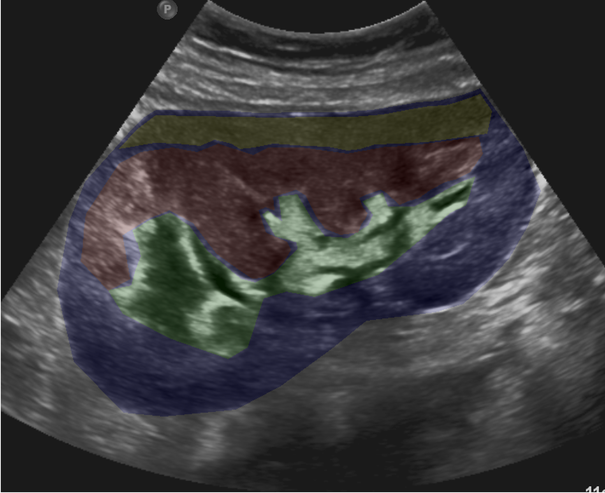

# kidneyUS
<!-- PROJECT SHIELDS -->
<!--
*** I'm using markdown "reference style" links for readability.
*** Reference links are enclosed in brackets [ ] instead of parentheses ( ).
*** See the bottom of this document for the declaration of the reference variables
*** for contributors-url, forks-url, etc. This is an optional, concise syntax you may use.
*** https://www.markdownguide.org/basic-syntax/#reference-style-links
-->
[![Contributors][contributors-shield]][contributors-url]
[![Stargazers][stars-shield]][stars-url]
[![Issues][issues-shield]][issues-url]
[![Version][version-shield]]

<!-- PROJECT LOGO -->
 

  

<h3 align="center">Open Kidney Dataset</h3>
  

    Fine-grained Annotated Ultrasound for Medical Image Analysis
     
    <a href="https://github.com/rsingla92/kidneyUS/issues">Report Bug</a>
    ·
    <a href="https://github.com/rsingla92/kidneyUS/issues">Request Feature</a>
  

<!-- TABLE OF CONTENTS -->

  
Table of Contents

  <ol>
    <li><a href="#about-the-project">About The Project</a></li>
    <li><a href="#repository-structure">Repository Structure</a></li>
    <li><a href="#data-structure">Data Structure</a></li>
    <li><a href="#contributing">Contributing</a></li>
    <li><a href="#access">Access</a></li>
    <li><a href="#license">License</a></li>
    <li><a href="#citation">Citation</a></li>
    <li><a href="#contact">Contact</a></li>
    <li><a href="#acknowledgments">Acknowledgments</a></li>
  </ol>

<!-- ABOUT THE PROJECT -->
## About The Project

Ultrasound imaging is a portable, real-time, non-ionizing, and non-invasive imaging modality. It is the first line for numerous organs, including the kidney. With recent advances in technology, the world of artificial intelligence (AI)-enhanced ultrasound is imminently upon us. However, compared to other modalities like CT or MRI, there is a lack of open ultrasound data available for researchers to use.

We present the Open Kidney Dataset. It includes over 500 two-dimensional B-mode abdominal ultrasound images and two sets of fine-grained polygon annotations, each generated by an expert sonographer, for four classes that are available for non-commericial use.

Artificial intelligence for medical imaging has seen unprecedented growth in the last ten years. As a result of the creation of imaging data being made available to researchers, cornerstone algorithms like U-net have been created. However, in the field of ultrasound, there is a lack of high quality data available. This is in part due to difficulty in acessing medical imaging data as well as anonymization and privacy considerations. However, even in competititions within biomedical imaging, such as the The MICCAI Segmentation Decathalon, ultrasound is underrpresented. The lack of data accentuates the growing reproducibility crisis within the ultrasound machine learning field. To the best of our knowledge there is no widely available kidney ultrasound dataset that exists. To further expand and improve academic efforts for machine learning in ultrasound, we present the Open Kidney Dataset.

This dataset may provide standardization to ultrasound segmentation benchmarking, as well as in the long-term reduce ultrasound interpretation efforts, furthering simplifying ultrasound use.

Insitutional approval was received (H21-02375). The ultrasound images were originally acquired between January 2015 and September 2019. These B-mode ultrasound images are collected from real patients who had a clinical indication to receive an ultrasound investigation of their kidneys. Consequently, a significant portion are obtained in real-world situations such as at the bedside or intensive care units, rather than finely controlled laboratory conditions. The participant population includes adults with chronic kidney disease, prospective kidney donors, and adults with a transplanted kidney. No filtering for specific patient or imaging characteristics were made. No filtering for specific vendors were made, and hence a variety of ultrasound manufacturers are represented including Philips, General Electric (GE), Acuson, Siemens, Toshiba and SonoSite.

Each annotated image additionally comes with labels for the view type and kidney type (native or transplant).

(<a href="#readme-top">back to top</a>)

<!-- Repository Structure -->
## Repository Structure

The repository itself is laid out as per follows:

* The top level directory includes the `requirements.txt` and README
* `/src/` includes the scripts used to evaluation segmentation results. 
  * `/src/tools/` contains utility scripts to perform image manipulation, calculate distributions, etc.
  * `/src/echotools/` contains scripts used to process the DICOM images originally obtained. Note that only .PNG files are shared. These files are provided as reference.
  * `/src/annotation_analysis/` conatins utility scripts for evaluating the manual annotations provided by sonographers and calculate variance statistics on such annotations.
* `/labels/` contains the CSV files generated from the VGG Image Annotator for all images. Each CSV record includes the filename, file size, atributes on quality, the view type, and any brief comments provided by the sonographer. It also includes the coordinates for each polygon corresponding to each different annotation region. 

(<a href="#readme-top">back to top</a>)

<!-- Data Structure -->
## Data Structure

The data structure is provided as folder of PNG images. Each file corresponds to a randomly sampled image from a unique patient. No more than one image is from the same patient. Access to data requires registration.

(<a href="#readme-top">back to top</a>)

<!-- CONTRIBUTING -->
## Contributing

Contributions are what make the open source community such an amazing place to learn, inspire, and create. Any contributions you make are **greatly appreciated**.

If you have a suggestion that would make this better, please fork the repo and create a pull request. You can also simply open an issue with the tag "enhancement".
Don't forget to give the project a star! Thanks again!

1. Fork the Project
2. Create your Feature Branch (`git checkout -b feature/AmazingFeature`)
3. Commit your Changes (`git commit -m 'Add some AmazingFeature'`)
4. Push to the Branch (`git push origin feature/AmazingFeature`)
5. Open a Pull Request

(<a href="#readme-top">back to top</a>)

<!-- Access -->
## Access

Please complete the registration form at this link: https://ubc.ca1.qualtrics.com/jfe/form/SV_1TfBnLm1wwZ9srk

(<a href="#readme-top">back to top</a>)

<!-- LICENSE -->
## License

The data and code is made available are under the CC BY-NC-SA license. Data may not be used for commercial purposes. Due to accessibility and privacy terms, registration is required for manual verification prior to the release of data.

(<a href="#readme-top">back to top</a>)

<!-- CITATION -->
## Citation

Singla R, Ringstrom C, Hu G, Lessoway V, Reid J, Nguan C, Rohling R. The open kidney ultrasound data set. arXiv preprint arXiv:2206.06657. 2022 Jun 14.

(<a href="#readme-top">back to top</a>)

<!-- CONTACT -->
## Contact

Rohit Singla  - rsingla@ece.ubc.ca

Project Link: [https://github.com/rsingla92/kidneyUS](https://github.com/rsingla92/kidneyUS)

(<a href="#readme-top">back to top</a>)

<!-- ACKNOWLEDGMENTS -->
## Acknowledgments

The authors thank the patients whose data comprises this data set as well as the
Biomedical Imaging and Artificial Intelligence Cluster for infrastructure and support.
R.S. acknowledges funding from the Vanier Graduate Scholarship, the Kidney
Foundation of Canada, and the American Society of Transplant Surgeons. C.R.
acknowledges funding from Natural Sciences and Engineering Council of Canada
(NSERC).

(<a href="#readme-top">back to top</a>)

<!-- MARKDOWN LINKS & IMAGES -->
<!-- https://www.markdownguide.org/basic-syntax/#reference-style-links -->
[contributors-shield]: https://img.shields.io/github/contributors/rsingla92/kidneyUS.svg?style=for-the-badge
[contributors-url]: https://github.com/rsingla92/kidneyUS/graphs/contributors
[stars-shield]: https://img.shields.io/github/stars/rsingla92/kidneyUS.svg?style=for-the-badge
[stars-url]: https://github.com/rsingla92/kidneyUS/stargazers
[issues-shield]: https://img.shields.io/github/issues/rsingla92/kidneyUS.svg?style=for-the-badge
[issues-url]: https://github.com/rsingla92/kidneyUS/issues
[license-shield]: https://img.shields.io/github/license/rsingla92/kidneyUS.svg?style=for-the-badge
[license-url]: https://github.com/rsingla92/kidneyUS/blob/master/LICENSE.txt
[version-shield]: https://img.shields.io/badge/version-14%20June%202022-blue?style=for-the-badge
